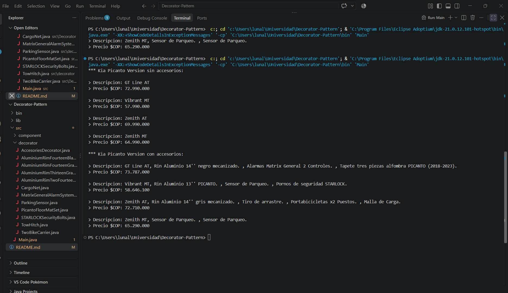

# Kia Picanto Cost
> Introduction to the Structural: Decorator Design Pattern

## Description
A small aplication of **Decorator design pattern** to obtain the total cost of differents versions of kia Picanto cars according to the accesories that the user wants.

### Why use Decorator Pattern un this case?
Decorator is a structural design pattern that lets you attach new behavior to object by placing these objects inside special wrapper objects that contain the behaviors. 
So, is perfect in this case, because according to the context is necessary to be able to assign extra accessories to the cars without breaking the code and eviting the class explotation problem.

### UML


## Project Sructure

```
src/
├── component/
│   └── GTLineAT.java
│   └── KiaPicantoVersion.java
│   └── VibrantMT.java
│   └── ZenithAT.java
│   └── ZenithMT.java
├── decorator/
│   └── AccesoriesDecorator.java
│   └── AluminiumRimFourteenBlack.java
│   └── AluminiumRimFourteenGray.java
│   └── AluminiumRimThirteenBlack.java
│   └── AluminiumRimTwoFourteenBlack.java
│   └── CargoNet.java
│   └── MatrixGeneralAlarmSystem.java
│   └── ParkingSensor.java
│   └── PicantoFloorMatSet.java
│   └── STARLOCKSecurityBolts.java
│   └── TowHitch.java
│   └── TwoBikeCarrier.java
└── Main.java
```

## How to Run
Requirements: JDK 8 or higher.

From the project root:

```bash
# Compile
javac -d out src/component/*.java src/decorator/*.java src/Main.java

# Run
java -cp out Main
```

## Console Output

